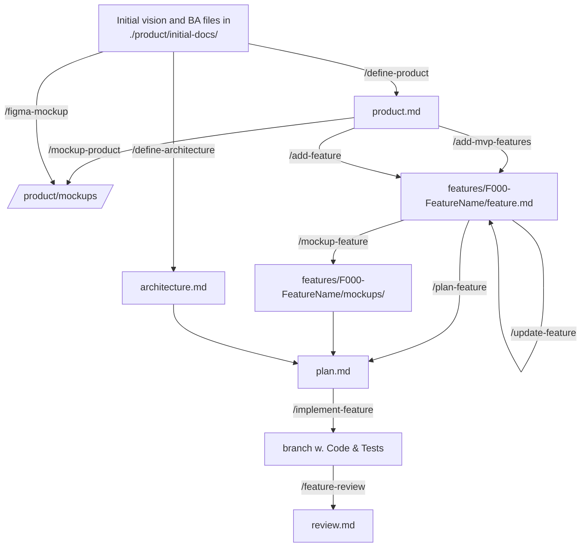
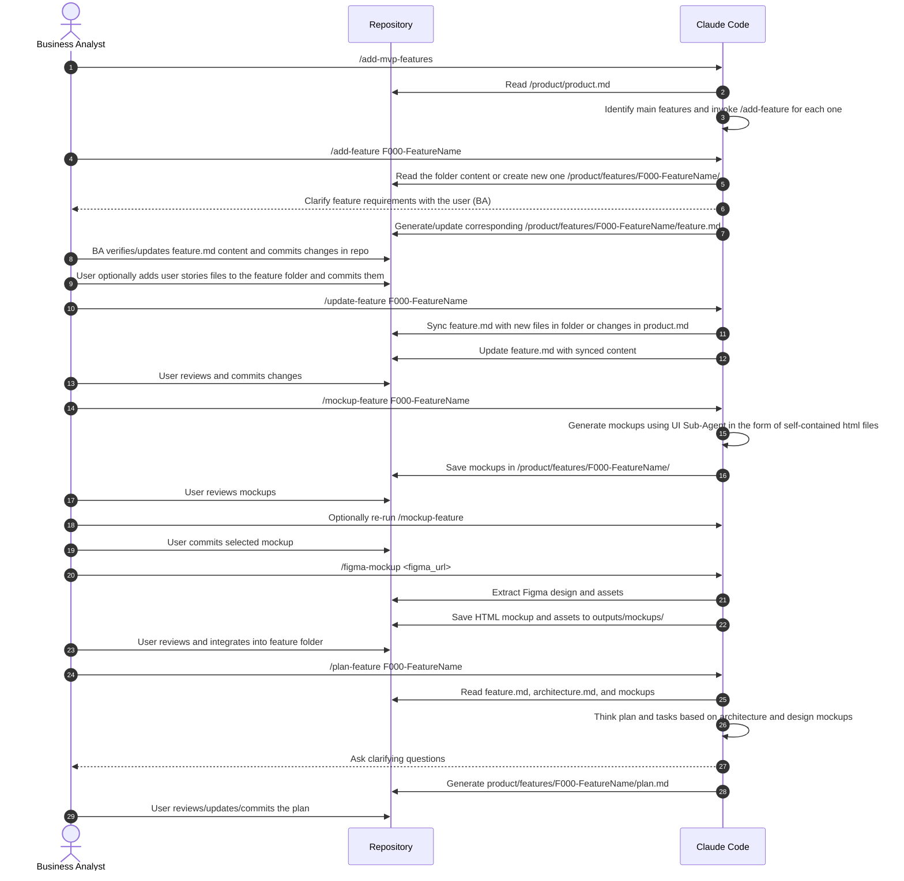
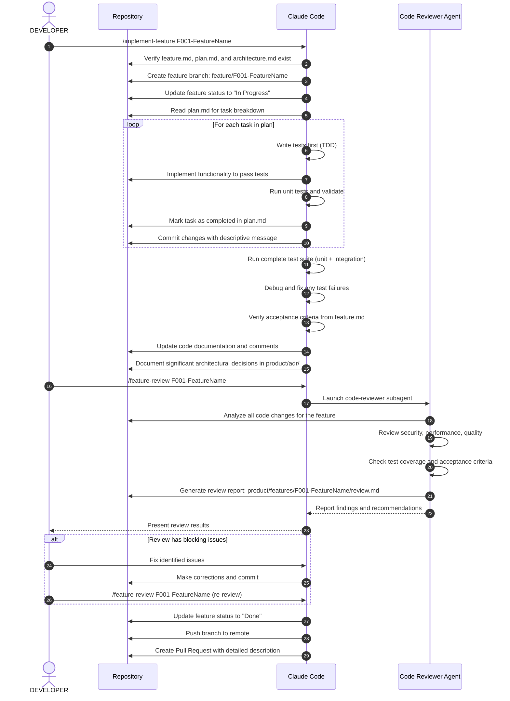

# AI-first Product Development Flow for Claude Code

The Flow facilitates AI Assisted Development by defining:

- Templates
- Slash Commands
- Agent Hooks
- Sub-Agents
- Rules files for various tech stacks

That together make AI Agent to drive the development process on all phases of SDLC.



## Product Definition

### Agent purpose at this phase

Based on the files in /product/inital-product/ folder, such as:

- Problem domain definition
- Market Research
- Solution Ideation
- Recrorded meetings conversations with stakeholders
- Business Requirements / Use Cases / User Journey Map
- Vision of the MVP

generates directory structure and detailed functional requirements.

The agent able to find gaps and contradictions and ask clarifying questions to ensure consistency by involving human in the loop.

### Template for product.md

```text
---
Product Name:
Creation Date:
Status:
---
# Product Definition

## Product Purpose

The What

## Target Audience

The Who

## Problem Solved

The Why

## Concise Solution Description: 

The How

## Competitors 

## UVP

## Concerns, Risks and Limitations


## UI/UX Considerations

Define:

- The required type of UI (if any): mobile, web, other;
- Reference design(s) in the form of links or screenshots;
- Styling and design system if requested;

## Non-functional Requirements

Define if there any expectations:

- Internationalization
- Peformance related: Response time, latency
- Scalability related: User growth, Data volume, Geo-distribution
- Avalability: uptime requriements, fault tolerance, backups
- Security & Compliance: data protection, authentication, audit trails, GDPR, HIPAA, etc.


## Core Features

### Feature 001

High level feature 001 description

### EFearure 002

High level feature 002 description

...

## OPEN QUESTONS

Questions that need to be resolved before implementaion started.

```

### Product Definition Workflow


## Architecture Definition

### Architecture Definiton Template

```text
# Architecture and Deveopment Rules

## General Rules

KISS, ...

## Components

| Companent name | Purpose | Repository | Has UI? |
|----------------|---------|------------|---------|

## Component XXX

Tech Stack:

* Programming Language
* Framework(s)
* Main dependencies
* Database and data migration tools
* Build and package/dependency management tools

Tools: 

* Version control
* CI/CD
* Containerization

Deployment:

* Target Platform (e.g. GCP)
* QA & Release Process

Integrations:

* External APIs, etc.

Tech Design:

Taking into account non-functional requirements, define:

* API type
* DTOs and Persistent Objects
* Concurrency
* Performance


```

### Architecture Definition Workflow


## Feature Definition

Each High Level Feature or Epic is to be defined in separate folder prefixed by sequence number:
/product/features/000-short_feature_name/

The folder contains documentation related to this feature:

- The main feature.md document, generated by /define-feature command and reviewed and updated by user (BA)
- Additional sub-features or user stories in the form of story-000-name.md files created by user (BA)

Files feature.md and story-000-name.md should following typical JIRA issue template like below:

### Feature Template

Feature and User Story template:

```text
---
Title:
Created Date:
Updated Date:
Status:
---
# Feature Definition

## Description

## User Interface

References to mockups or examples of UI (if the feature includes components that has UI)

## Acceptance Criteria

Definition of Done that can be used to test the feature.

## Open Questions

Questions that should be resolved by the time of implementation.
```

### Feature Definition Workflow



## Feature Implementation


