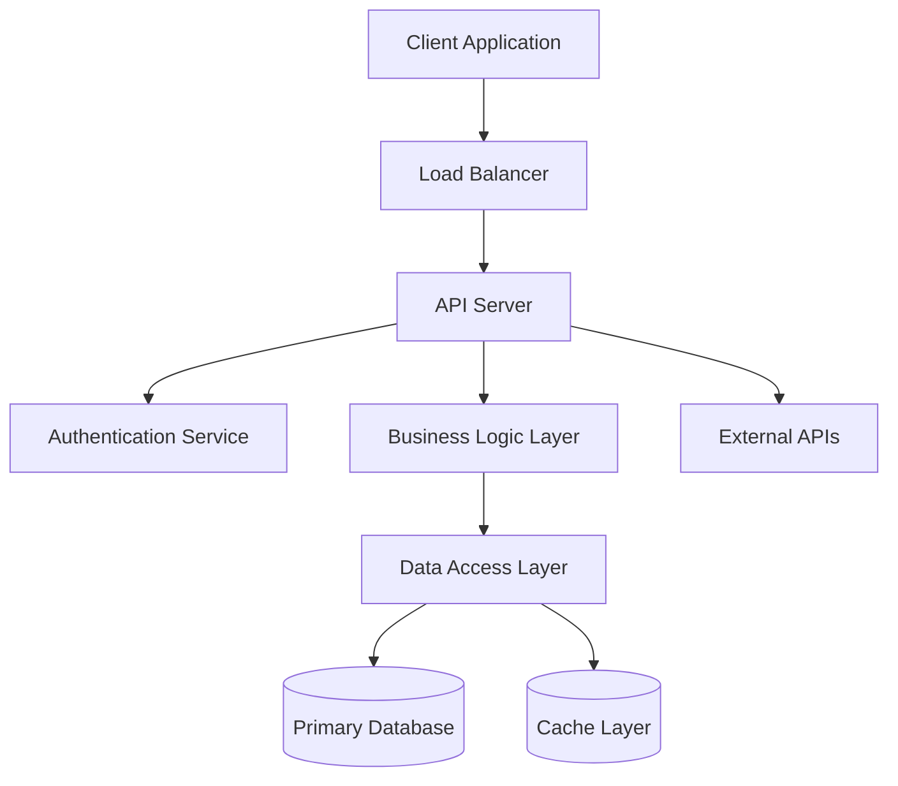

# Command Instructions

Use the `architecture` skill to apply architectural thinking and decision-making frameworks.

Your task: decompose requirements into a pragmatic high-level architecture with justified technology choices. Apply iterative refinement to resolve circular dependencies between architectural decisions and tech stack selection, producing a solution that balances technical excellence, maintainability, and real-world constraints. Document your reasoning at each decision point.

## Context

Verify `product/product.md` exists. If not, user must run `/define-product` first.

**Read:**

- `product/product.md` - Product requirements and constraints
- Documents from Bibliography section for additional context
- `product/architecture.md` (if exists) - Existing decisions to update
- `./**/CLAUDE.md`, `./**/AGENTS.md` (if exists) - Development preferences

## Task

1. Understand purpose, environment, interaction patters
2. Identify core architectural drivers
3. Propose high-level components with preliminary tech assumptions
4. Validate tech choices against components, refine both.
5. Consider architectural elements: architectural styles, programming languages and frameworks, API design, auth, infrastructure, deployment, caching, and performance strategies
6. Pay special attention to data layer: entities, relations, mapping, database
7. Evaluate Alternatives: Consider off-the-shelf solutions vs. custom development. Favore simplicity, proven solutions, and cost-effectiveness
8. Prioritize: clarity over complexity, pragmatism over perfection, and defensible choices over trendy ones.
9. Define deployment options and integration points.
10. Involve User when uncertain. Ask using this format:

    ```markdown
    Decision: [Technology/pattern]

    1. [Recommended]: [Benefits] | Trade-offs: [Limitations]
    2. [Alternative]: [Benefits] | Trade-offs: [Limitations]
    3. Another approach - specify
    P. Postpone decision
    ```

    Document the question and the decision

11. Define Coding conventions, testing approaches, Git strategy, CI/CD, review process, definition of done

12. Document decisions saving or updating `product/architecture.md` using teamplate below.

## Validation

- [ ] Architecture supports product goals and constraints
- [ ] Components and their teck stack are defined with specific versions
- [ ] Meaningful mermaid diagrams generated
- [ ] Development standards clearly defined
- [ ] Technology choices justified with rationale
- [ ] Clear tradeoffs and rationale explained for
- [ ] Security requirements are comprehensive
- [ ] Performance targets are realistic and measurable
- [ ] Development workflow and deployment process defined with rollback capability
- [ ] Testing strategy covers all layers

## Architecture Template

---

```markdown

# Architecture Definition

## Executive Summary

[Write 2-3 sentences describing the overall technical approach and key architectural decisions]

## Core Principles

1. **KISS (Keep It Simple)** - Choose proven, well-documented solutions over cutting-edge
2. **YAGNI (You Aren't Gonna Need It)** - Build only what's needed for MVP, evolve incrementally
3. **DRY (Don't Repeat Yourself)** - Establish reusable patterns and shared components
4. **Fail Fast** - Quick feedback loops, automated testing, early error detection
5. **Security by Design** - Security considerations integrated from the start

## System Architecture

[Visualize architecture with the help of (1) High Level Design - component diagram, (2) Data Flow Diagram, (3) Sequence or Activity Diagram or BPMN - choose which is more appropriate to the domain, (4) Entity Relationship Diagram (from business perspective), (5) State diagram (if state machine is at the heart of functionality and state flow is important)]

### High-Level Design

[An example of components diagram:]



### Sequence diagram

[Sequence diagram ]

### Data flow diagram

[Data Flow diagram]

### Component Overview

[List main components that are stored in separate root directories or repositories. An example of decomposition:]

| Component | Location | Primary Tech | Has UI |
|-----------|----------|---------------|-------|
| Frontend  | `/frontend`| Svelte      | Yes |
| Mobile    | `/mobile`  | Flutter     | Yes |
| BFF       | `/backend` | Java/Spring | No |
| AuthSrv   | `/keycloak`| Java        | No |

## Technology Stack Decisions

[Justify major technical decisions with clear rationale]

### Frontend

#### Primary Framework

- **Choice**: [React/Vue/Angular/Vanilla JS/Other]
- **Rationale**: [Reason for choice]
- **Alternatives Considered**: [Other options and why rejected]

#### Supporting Technologies

- **Styling**: [Tailwind CSS/Styled Components/CSS Modules/SCSS]
- **State Management**: [Redux/Zustand/Context API/Vuex/Built-in]
- **Build Tool**: [Vite/Webpack/Parcel/Next.js/Nuxt.js]
- **Testing**: [Jest/Vitest/Cypress/Testing Library]

### Backend

#### Primary Tech Stack

- **Choice**: [Node.js/Python/FastAPI/Java/Spring/Kotlin/Quarkus/Go/Gin/C#/.NET]
- **Rationale**: [Reason for choice]
- **Alternatives Considered**: [Other options and why rejected]

#### Supporting dependencies

- **ORM/Database Access**: [Prisma/TypeORM/SQLAlchemy/GORM/Entity Framework]
- **Validation**: [Joi/Zod/Pydantic/Bean Validation]
- **Testing**: [Jest/Pytest/JUnit/Go test]
- **Documentation**: [Swagger/OpenAPI/GraphQL Schema]

#### Data Layer

- **Primary Database**: [PostgreSQL/MySQL/MongoDB/SQLite]
- **Rationale**: [Reason for choice]
- **Schema Strategy**: [Code-first/Database-first/Migration-based]

### Caching Strategy

- **Technology**: [Redis/Memcached/In-memory/None]
- **Use Cases**: [Session storage/API responses/computed data]

### Infrastructure & DevOps

**Deployment**: [Vercel/Netlify/AWS/GCP/Azure/Docker/Traditional hosting]
**CI/CD**: [GitHub Actions/GitLab CI/Jenkins/CircleCI]
**Monitoring**: [Basic logging/Sentry/DataDog/New Relic/Custom]
**Environment Management**: [Docker/Virtual environments/Native]

## Development Standards

### Code Organization

[Tree-like structure, example:]

```sh
project-root/
├── frontend/              # Client-side application
│   ├── src/
│   │   ├── components/    # Reusable UI components
│   │   ├── pages/         # Page-level components
│   │   ├── hooks/         # Custom hooks (React)
│   │   ├── utils/         # Utility functions
│   │   └── styles/        # Global styles
│   └── tests/             # Frontend tests
├── backend/               # Server-side application
│   ├── src/
│   │   ├── routes/        # API endpoints
│   │   ├── models/        # Data models
│   │   ├── services/      # Business logic
│   │   ├── middleware/    # Request middleware
│   │   └── utils/         # Utility functions
│   └── tests/             # Backend tests
├── shared/                # Shared types/utilities
├── product/                  # Project documentation
└── scripts/               # Build and deployment scripts
```

### Coding Conventions

**Code Style**:

- **Formatter**: [Prettier/Black/gofmt/Standard]
- **Linter**: [ESLint/Pylint/golint/TSLint]

**Git Workflow**:

- **Branch Strategy**: [Git Flow/GitHub Flow/Feature branches]
- **Commit Messages**: [Conventional Commits/Custom format]
- **PR Requirements**: [Review approval/Tests passing/No conflicts]

### Testing Strategy

**Test Pyramid**:

- **Unit Tests**: [>70% coverage required]
  - Test individual functions and components
  - Mock external dependencies
  - Fast execution (<100ms per test)

- **Integration Tests**: [API endpoints/Database operations]
  - Test component interactions
  - Use test database/environment
  - Verify data flow and business logic

- **End-to-End Tests**: [Critical user workflows]
  - Test complete user journeys
  - Use staging environment
  - Cover happy path and key error scenarios

**Testing Tools**:

- **Unit**: [Jest/Pytest/Go test/JUnit]
- **Integration**: [Supertest/TestClient/REST Assured]
- **E2E**: [Cypress/Playwright/Selenium]

### API Design Standards

**API Style**: [REST/GraphQL/RPC]
**Base URL**: [https://api.domain.com/v1]
**Authentication**: [JWT/OAuth 2.0/API Keys/Session-based]

#### REST Conventions (if applicable)

**Error Handling**:

```json
{
  "error": {
    "code": "VALIDATION_ERROR",
    "message": "User-friendly error message",
    "details": ["Specific field errors"],
    "timestamp": "2024-01-01T00:00:00Z"
  }
}
```

## Security Requirements

### Authentication & Authorization

- **User Authentication**: [Method and requirements]
- **Session Management**: [Approach and timeout]
- **Role-Based Access**: [Roles and permissions]
- **API Security**: [Rate limiting/API keys/OAuth]

### Data Protection

- **Data Encryption**: HTTPS for all communications, avoid or encrypt sensitive data at rest
- **Input Validation**: Validate and sanitize all user inputs
- **SQL Injection Prevention**: Use parameterized queries/ORM
- **XSS Protection**: Escape output, Content Security Policy headers
- **CSRF Protection**: [Tokens/Same-site cookies/Other]

### Security Checklist

- [ ] All environment variables for secrets (no hardcoded credentials)
- [ ] Input validation on all API endpoints
- [ ] SQL injection prevention (parameterized queries)
- [ ] XSS protection (output escaping, CSP headers)
- [ ] HTTPS enforced in production
- [ ] Security headers configured (HSTS, CSP, etc.)
- [ ] Authentication and authorization properly implemented
- [ ] Regular dependency security audits

## Performance Requirements

### Response Time Targets

- **API Endpoints**: <200ms for simple queries, <500ms for complex operations
- **Page Load**: <2s initial load, <500ms subsequent navigation
- **Database Queries**: <100ms for simple queries, <1s for reports

### Scalability Considerations

- **Concurrent Users**: Support [number] simultaneous users
- **Data Volume**: Handle [amount] of data with acceptable performance
- **Growth**: Architecture can scale to [multiplier]x current requirements

### Optimization Strategies

- **Caching**: [Strategy and duration]
- **Database**: Proper indexing, query optimization
- **Frontend**: Code splitting, lazy loading, image optimization
- **CDN**: Static asset delivery via CDN

## Deployment & Operations

### Environment Strategy

- **Development**: Local development with [database and services]
- **Staging**: Production-like environment for final testing
- **Production**: [Hosting platform] with [backup and monitoring]

### Deployment Process

1. **Code Review**: All changes require peer review and approval
2. **Automated Testing**: All tests must pass in CI pipeline
3. **Staging Deployment**: Deploy to staging for final validation
4. **Production Deployment**: [Deployment strategy: blue-green/rolling/canary]
5. **Health Checks**: Verify deployment success and system health

### Monitoring & Maintenance

- **Application Monitoring**: [Error tracking/Performance monitoring]
- **Infrastructure Monitoring**: [Server health/Database performance]
- **Logging**: Centralized logging with [retention policy]
- **Backup Strategy**: [Frequency and retention]
- **Update Schedule**: [Security patches/Dependency updates]

## Open Technical Questions

- [ ] [Pending decision that affects implementation]

```
